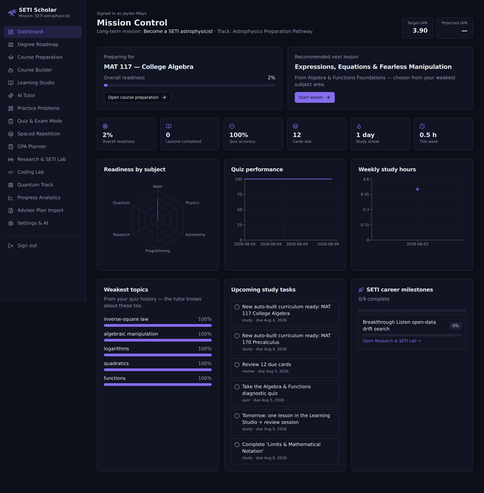
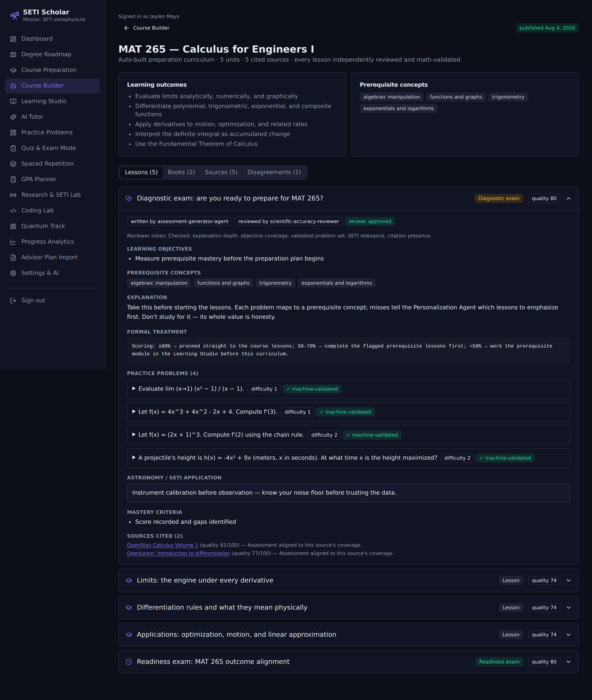
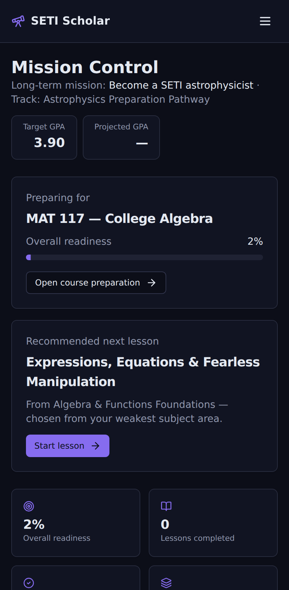

# 🔭 SETI Scholar

A full-stack course-preparation platform built for one mission: **become a SETI astrophysicist**.

SETI Scholar teaches the prerequisite knowledge for every course in an online physics /
astronomical & planetary sciences degree *before* you enroll in it — with adaptive lessons,
server-graded quizzes, SM-2 spaced repetition, an AI tutor that knows your weak topics, an
editable multi-path degree roadmap, GPA planning, a research lab focused on technosignatures
and radio astronomy, and a quantum-computing secondary track.

## Screenshots

Live captures from the running app (full gallery in [`docs/screenshots/`](docs/screenshots/)):

| Mission Control | Auto-built curriculum | Mobile |
|---|---|---|
|  |  |  |

Also in the gallery: degree roadmap, Course Builder pipeline, book recommendations with
licensing status, scored sources with selection history, Learning Studio lessons, AI tutor,
spaced repetition, coding lab, and progress analytics.

## Stack

| Layer | Technology |
|---|---|
| Framework | Next.js 15 (App Router) + React 19 + TypeScript |
| Styling | Tailwind CSS + shadcn-style component library (Radix primitives) |
| Database | PostgreSQL + Prisma ORM |
| Auth | NextAuth v5 (credentials + JWT, bcrypt-hashed passwords) |
| AI | Server-side provider abstraction: Anthropic **or** OpenAI, with a deterministic offline tutor fallback |
| Charts | Recharts (readiness radar, quiz trends, weekly hours, GPA projection, mastery bars) |
| Validation | Zod on every API route |
| Scheduling | Cron-friendly job endpoint for spaced-repetition reminders (no Redis required; see below) |
| Tests | Vitest (31 unit tests) + Playwright (desktop + mobile e2e) |

## Quick start

```bash
cd seti-scholar
npm install

# 1. Database (Docker option)
docker compose up -d          # Postgres 16 on :5432

# 2. Environment
cp .env.example .env          # then set AUTH_SECRET (openssl rand -base64 32)

# 3. Schema + seed content (20 modules, 33 lessons, 90+ questions, 7 coding
#    challenges, 6 degree paths, career milestones, demo user)
npx prisma db push
npm run db:seed

# 4. Run
npm run dev                   # http://localhost:3000
```

**Demo login:** `jaylen@setischolar.dev` / `ad-astra-2026` — or register a fresh account;
every new user is auto-provisioned with the full roadmap, starter flashcards, research
project, and milestones.

## Autonomous knowledge & source discovery

SETI Scholar finds, evaluates, and cites its own legal learning materials — no textbook
uploads required (uploads stay optional: syllabi, DARS reports, and advisor lists import via
Advisor Plan Import).

**Course Builder pipeline** (the required review chain, enforced in code):

```
Source Discovery → Source Verification → Curriculum Design → Lesson Generation
→ Assessment Generation → Mathematical Validation → Scientific Accuracy Review
→ Citation Validation → Publication
```

- **Agent roster**: Source Discovery, Source Verification, Curriculum Architect, Lesson
  Writer, Assessment Generator, Mathematical Validator, Scientific Accuracy Reviewer,
  Citation Agent, Personalization Agent, Mastery & Remediation Agent, Course Update Agent.
  The agent that writes a lesson is never the only agent that verifies it — the reviewer is a
  distinct agent and throws on any attempt to review its own writing; every published lesson
  records `writtenBy` and `reviewedBy`.
- **Discovery**: a curated catalog of vetted open resources (OpenStax, LibreTexts, MIT OCW,
  OpenLearn, Feynman Lectures, NASA/ESA/NIST/NRAO/Green Bank/SETI Institute/Breakthrough
  Listen, arXiv, official Python/NumPy/SciPy/Astropy/pandas/scikit-learn/Qiskit/Cirq/
  PennyLane docs, Project Gutenberg) plus live metadata connectors (Open Library, Google
  Books, Crossref, arXiv, Semantic Scholar) that augment it when the network allows and fail
  gracefully when it doesn't — the app is fully autonomous offline.
- **Source quality rubric**: every source is scored 0-100 across authority, relevance,
  licensing, completeness, recency, clarity, citation quality, and level fit; per-criterion
  scores are stored and shown in the UI. Selection requires multiple strong sources (never
  one book) with type diversity. A full **source history** (discovered/scored/selected/
  refreshed events) explains why each resource was chosen.
- **Copyright policy, enforced in code** (`access-policy.ts` + tests): only approved domains
  are ever stored; full text is treated as readable only with a verifiably open license; the
  system stores metadata and its own original lessons, never copyrighted full text; access
  status can never be upgraded to "open" without license evidence; commercial textbooks are
  recommended as metadata with the rationale, relevant chapters, and a legitimate purchase/
  library lookup path — no pirate sources, no paywall bypasses, ever.
- **Generated curricula**: per course — objectives, prerequisite concepts, a diagnostic exam,
  original lessons (conceptual + formal explanations, worked examples, machine-validated
  practice problems, common mistakes, an astronomy/SETI application, mastery criteria,
  follow-up resources, per-lesson citations with source quality), and a readiness exam
  aligned to course outcomes.
- **Mathematical validation**: a built-in expression engine + polynomial calculus module
  independently re-derives every generated answer (and cross-checks symbolic derivatives
  against difference quotients); problems that fail verification never reach the student.
- **Contradiction handling**: documented disagreements between sources (e.g. the Hubble
  constant tension, SI vs. Gaussian E&M units, drift-rate window assumptions in SETI
  surveys) are surfaced with an explanation and practical guidance.
- **Continuous operation** (`POST /api/jobs/autonomy`, cron-ready via
  `npm run jobs:autonomy`): auto-builds curricula for upcoming courses, refreshes stale
  source metadata, converts weak quiz topics into remediation lessons, schedules the next
  day's study session, and posts a notice when readiness clears the bar to start the official
  course. The user only chooses a degree path — the system handles the rest.

## The 15 sections

1. **Dashboard** — mission control: readiness %, quiz accuracy, weakest topics, cards due, streak, weekly hours, target vs. projected GPA, upcoming tasks, recommended next lesson, research progress, career milestones, and charts.
2. **Degree Roadmap** — six editable paths (Physics BS draft, APS BS draft, custom astrophysics pathway, grad-school prerequisites, SETI research specialization, quantum secondary). Add/remove/reorder courses, edit prerequisites, semesters, grades, transfer credits; compare any two paths; remaining-credit and graduation estimates; grad-prereq gap detection. Nothing is hardcoded — the ASU degree can be confirmed later and imported.
3. **Course Preparation** — every course maps to prep modules; readiness = 55% lesson completion + 45% demonstrated quiz mastery. Set any course as your current focus.
4. **Learning Studio** — 20 modules spanning algebra → calculus → linear algebra → mechanics → E&M → modern physics → QM → astronomy → stellar astrophysics → Python → NumPy/SciPy → Fourier/signal processing → radio astronomy & SETI methods → ML → quantum computing. Markdown lessons with objectives and SETI-connected examples.
5. **Expert AI Tutor** — server-side Anthropic/OpenAI abstraction (keys never reach the browser). The system prompt injects your name, current course, weak topics from quiz analytics, and teaching style (Socratic / detailed / direct). Falls back to a useful offline tutor with no key.
6. **Practice Problems** — instant per-question feedback with explanations.
7. **Quiz & Exam Mode** — server-graded; exam mode is adaptive (previously-missed topics appear more often). Missed questions automatically become spaced-repetition cards.
8. **Spaced Repetition** — full SM-2 scheduler (ease factor, intervals, lapses) with Again/Hard/Good/Easy ratings and manual card creation.
9. **GPA Planner** — earned + planned grades per course, projected GPA, required average to hit your target, cumulative trajectory chart.
10. **Research & SETI Lab** — milestone-tracked research projects (seeded: a Breakthrough Listen open-data drift search), the 9-step career ladder to the SETI Institute, and field resources.
11. **Coding Lab** — Python/NumPy/signal-processing/ML/quantum challenges drawn from real SETI workflows (SNR, waterfall arrays, de-doppler drift correction, FFT tone finding, RFI classification, qubit simulation) with hints, reference solutions, and saved submissions.
12. **Quantum Computing Track** — secondary specialization: linear algebra → QM math → qubits/gates/algorithms, with its own course sequence and challenges. Complements (never replaces) the astro pathway.
13. **Progress Analytics** — readiness radar by subject, quiz performance over time, weekly hours vs. goal, GPA projection, mastery ranked by module, topic-level accuracy.
14. **Advisor Plan Import** — paste a DARS extract or advisor course list; the parser recognizes codes, titles, credits, grades, and terms (including `FA25`-style); preview, then import/merge into any path. Raw text is archived.
15. **Settings & AI Configuration** — provider/model/teaching style, target GPA, weekly-hours and review goals, reminder toggle.
16. **Course Builder** (`/builder`) — run the autonomous agent pipeline per course; browse generated curricula, book recommendations, scored sources with full selection history, and documented source disagreements.

## Spaced-repetition reminders (scheduled job)

`POST /api/jobs/spaced-repetition` (Bearer `JOBS_SECRET`) scans for due cards and creates
review reminders for users with reminders enabled. Schedule it any way you like:

```bash
# cron
0 13 * * *  cd /path/to/seti-scholar && npm run jobs:spaced-repetition
```

or point Vercel Cron / GitHub Actions / a systemd timer at the endpoint. The design keeps the
app deployable anywhere without a Redis dependency; swap in a queue later without touching
callers.

## Testing

```bash
npm test          # Vitest: SM-2 scheduler, GPA math, readiness scoring, advisor parser
npm run test:e2e  # Playwright: auth redirect, login → all sections, tutor reply, quiz round-trip
                  # (desktop Chrome + mobile profiles; seed the DB first)
npm run typecheck
```

In sandboxed/CI environments where the Playwright browser cache is unavailable:
`PLAYWRIGHT_CHROMIUM_PATH=/path/to/chromium npm run test:e2e`.

## Architecture notes

- **Adaptivity**: quiz answers update per-topic accuracy → drives the dashboard's weakest
  topics, the recommended next lesson (lowest-readiness module for your focus course), exam
  question selection, automatic review-card creation, and the tutor's system prompt.
- **Security**: passwords bcrypt-hashed (cost 12); JWT sessions; every API route revalidates
  the session server-side and scopes queries by user id; Zod validates all input; AI keys and
  grading logic live exclusively on the server; the jobs endpoint requires a bearer secret.
- **Mobile**: responsive throughout — collapsible drawer nav on phones, card grids that
  stack, horizontally scrollable tables, native selects.
- **Provisioning**: new users get all six degree paths, milestones, starter cards, tasks, and
  a research project from `src/lib/provision.ts`; global content seeds idempotently from
  `prisma/seed.ts`.

> ⚠️ Academic disclaimer: degree paths modeled on ASU programs are drafts for planning.
> Always confirm actual degree requirements with your ASU academic advisor.
